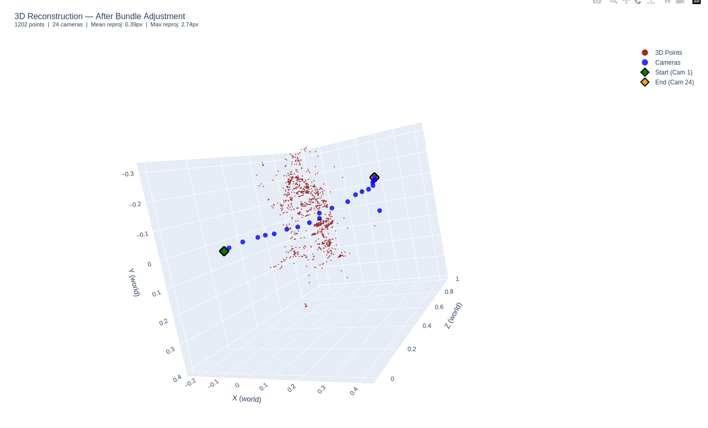

# Structure from Motion Pipeline

Incremental SfM pipeline recovering 3D structure and camera poses from a monocular image sequence. Built from scratch — feature extraction, F/E matrix estimation, pose recovery, incremental triangulation, and bundle adjustment via GTSAM.

---

## Problem

Recovering 3D structure from a sequence of 2D images has direct real-world utility: archaeologists use it to create digital preservation records of artifacts and heritage sites before they deteriorate; structural engineers use it to monitor infrastructure like bridges and facades for deformation over time; field robotics teams use it to build maps from drone imagery for terrain analysis and mission planning. In all of these cases, the only sensor available is a camera — no depth sensor, no IMU, no GPS.

The goal here: given a monocular image sequence of an object, recover its 3D geometry and the camera trajectory that produced it, using only 2D pixel correspondences across frames.

The challenge is that every stage compounds error: bad matches corrupt F, bad F corrupts E, bad E corrupts poses, bad poses corrupt triangulation, and BA can't fix what's fundamentally broken upstream. Each module needs to be robust enough that the next one has something to work with.

---

## Results Visualization

**3D Reconstruction (after Bundle Adjustment)**



**Camera Trajectory** — estimated path (X-Y top-down) vs COLMAP ground truth.

**3D Reconstruction (before BA)** — raw incremental SfM output before optimization.

Interactive HTML plots saved to `results/`.

---

## Approach

**Feature tracking:** SIFT detection and matching with Lowe's ratio test (0.75) per consecutive pair. Features re-detected fresh for each pair so pixel coordinates are consistent across frames — this is what makes the incremental track management work reliably.

**Geometry estimation:** Normalized 8-point algorithm with RANSAC for F matrix. E matrix recovered via SVD decomposition. Pose selected by cheirality check across all 4 candidate solutions.

**Incremental reconstruction:** Forward loop mirroring standard SfM — seed pair triangulates initial points, every subsequent frame registered via PnP against the growing point cloud, new points triangulated and added. Track management stores observations as `(cam_idx, pixel_coord)` tuples for exact lookup.

**Bundle adjustment:** GTSAM Levenberg-Marquardt jointly optimizing all camera poses and 3D points. Outlier observations filtered by reprojection error before BA, points filtered by minimum observation count to ensure the graph is well-conditioned.

---

## Results

24-image sequence of a Buddha statue. Full loop around the object.

| Metric | Value |
|---|---|
| Cameras recovered | 23 / 24 |
| 3D points (after filter) | 1202 |
| Mean reprojection error (before BA) | 0.76 px |
| Mean reprojection error (after BA) | 0.39 px |
| BA error reduction | 80% |
| Trajectory length | 2.65 units (normalized scale) |

COLMAP ground truth trajectory length: 22.77 units. Scale difference is expected — monocular SfM recovers structure up to an unknown scale factor. Trajectory shape matches COLMAP qualitatively.

---

## Structure

```
StructurefromMotion_pipeline/
├── src/
│   ├── io.py                  # image loading, COLMAP intrinsics reader
│   ├── features.py            # SIFT/ORB detection, matching, visualization
│   ├── geometry.py            # 8-point algorithm, RANSAC, Sampson distance
│   ├── matching.py            # sequential match loop, sliding window
│   ├── reconstruction.py      # E matrix, pose selection, triangulation
│   ├── cam_trajectory.py      # world-frame trajectory chaining, 2D plot
│   ├── cam_traj_eval.py       # COLMAP comparison, baseline analysis
│   ├── pointcloud.py          # incremental point cloud, track management
│   ├── pnp.py                 # incremental SfM loop, PnP registration
│   ├── visualization.py       # 3D Plotly reconstruction viewer
│   └── bundle_adjustment.py   # GTSAM BA, observation filtering
├── sfm/
│   └── sfm_pipeline.py        # main script — runs full pipeline
├── data/
│   ├── images/buddha_images/  # input image sequence
│   └── colmap/                # cameras.bin, images.bin (ground truth)
└── results/                   # output plots and HTML files
```

---

## Run

```bash
cd StructurefromMotion_pipeline
python3 sfm/sfm_pipeline.py
```

Outputs saved to `results/`:
- `trajectory.png` — 2D camera path
- `reconstruction_before_ba.html` — interactive 3D view before BA
- `reconstruction_after_ba.html` — interactive 3D view after BA

---

## Dependencies

```bash
pip install opencv-python numpy matplotlib plotly gtsam
```

---

## Data

Place images in `data/images/<sequence_name>/` and COLMAP reconstruction files in `data/colmap/`.

COLMAP is used only for ground truth comparison (`cameras.bin` for intrinsics, `images.bin` for trajectory evaluation). The pipeline itself runs independently of COLMAP.
